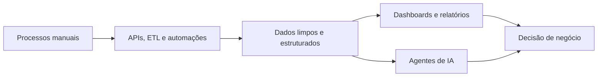

<!--
  GitHub Profile README for: gustdias0
  Suggested positioning: Data • Automation • AI Solutions
  Replace project links marked as "em documentação" when the repositories are public.
-->

  
  
  
  

---

## 👨‍💻 Sobre mim

Sou estudante de **Ciência da Computação** e desenvolvedor focado em **dados, automação e IA aplicada a negócios**.

Tenho experiência construindo **pipelines ETL**, automações com **Python/N8N**, integrações com **APIs**, dashboards em **Power BI/Looker Studio** e soluções simples de software para transformar processos manuais em fluxos mais claros, rápidos e escaláveis.

- 🔭 Atualmente trabalho como **Automation & AI Solutions Developer — Freelance**.
- 📊 Meu foco principal é unir **engenharia de dados**, **automação** e **inteligência artificial** para resolver problemas reais.
- 🤖 Também tenho experiência com eletrônica, sistemas embarcados e robótica pela equipe **TATUBOTz**.
- 🎯 Objetivo atual: evoluir como **Data Engineer / Backend Developer** com foco em produtos orientados por dados.

---

## 🧠 Stack principal

### Linguagens, dados e backend

  

---

## 🚀 Projetos em destaque

<table>
  <tr>
    <td width="50%" valign="top">
      <h3>🤖 Assistente de Suporte Emocional via WhatsApp</h3>
      

        Chatbot com IA, memória persistente e relatórios para acompanhamento humano. Projeto pensado com foco em privacidade, rastreabilidade e apoio profissional, sem substituir atendimento especializado.
      

      

        <strong>Stack:</strong> Python · Claude API · N8N · Supabase · WhatsApp
      

      

        
        
      

    </td>
    <td width="50%" valign="top">
      <h3>📈 Pipeline Automatizado de Vendas e Relatórios</h3>
      

        Pipeline ETL para extrair, tratar e carregar dados comerciais em dashboards, reduzindo consolidação manual e melhorando a leitura de KPIs operacionais.
      

      

        <strong>Stack:</strong> Python · SQL · Pandas · Power BI · N8N
      

      

        
        
      

    </td>
  </tr>
  <tr>
    <td width="50%" valign="top">
      <h3>🧹 Data Cleaning & Analytics Lab</h3>
      

        Estudos e cases práticos de limpeza, transformação e análise de dados usando Python, SQL, R e visualização para responder perguntas de negócio.
      

      

        <strong>Stack:</strong> Python · SQL · R · Jupyter · Tableau/Power BI
      

      

        
        
      

    </td>
    <td width="50%" valign="top">
      <h3>⚙️ Robótica, Eletrônica e Telemetria</h3>
      

        Desenvolvimento e testes de sistemas eletrônicos embarcados, sensores e análise de dados de robôs de competição em ambiente multidisciplinar.
      

      

        <strong>Stack:</strong> C · Python · Sensores · Git/GitHub · Eletrônica
      

      

        
        
      

    </td>
  </tr>
</table>

> Repositórios públicos com documentação completa serão adicionados aqui. A prioridade é publicar cases com problema, arquitetura, solução, impacto e aprendizados.

---

## 🧩 O que eu entrego

| Área | Como aplico |
|---|---|
| **Automação** | Criação de fluxos com Python, N8N e integrações entre sistemas |
| **Dados** | ETL, limpeza, modelagem simples, consultas SQL e dashboards |
| **IA aplicada** | Agentes, prompts estruturados, integrações com LLMs e automações inteligentes |
| **BI** | Relatórios, KPIs, storytelling e visualização para tomada de decisão |
| **Sistemas simples** | Interfaces web, bancos de dados e APIs para consumo de dados |

---

## 📚 Formação e certificações selecionadas

- 🎓 **Ciência da Computação** — FACAPE
- 📊 **Google Data Analytics Professional Certificate** — Coursera/Google
- 🐍 **Santander 2025 — Ciência de Dados com Python** — DIO
- 📈 **Bootcamp Klabin — Excel e Power BI Dashboards** — DIO
- 🤖 **Google AI Essentials** — Google
- 🧠 **Intermediate Python** — DataCamp

---

## 📊 GitHub analytics

  

  

  

<!--
Optional: Snake animation.
To use this section, add the snake.yml workflow to .github/workflows/snake.yml.
Then uncomment the block below.

<picture>
  <source media="(prefers-color-scheme: dark)" srcset="https://raw.githubusercontent.com/gustdias0/gustdias0/output/github-contribution-grid-snake-dark.svg" />
  <source media="(prefers-color-scheme: light)" srcset="https://raw.githubusercontent.com/gustdias0/gustdias0/output/github-contribution-grid-snake.svg" />
  
</picture>

-->

---

## 📬 Vamos conversar?

Estou aberto a oportunidades, colaboração em projetos de dados, automação, IA aplicada e desenvolvimento de soluções digitais.

  

